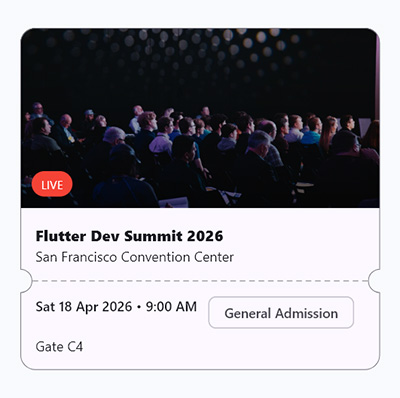
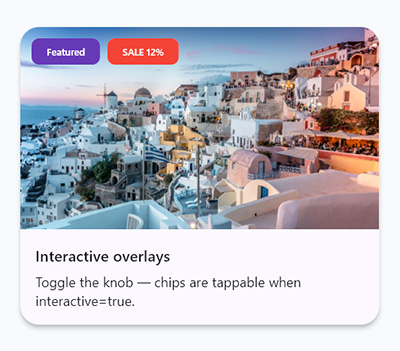
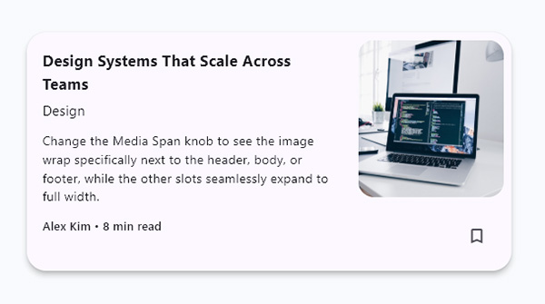

# Flux Card

> A composition-first, constraint-aware card layout engine for Flutter.

`flux_card` helps you build rich, reusable cards from a consistent set of primitives instead of 
repeating one-off widget trees across your app.

It gives you:

* named content slots
* multiple layout modes
* overlays and underlays
* notch support
* built-in loading skeletons
* theme presets with `ThemeExtension`
* **[NEW]** zero-boilerplate `FluxCard.simple()` factory
* **[NEW]** expandable media and screen-reader semantics merging

Version **0.2.0** is the latest public release.

---

## Preview

<p align="center">
  
</p>
<p align="center">
  
  
</p>
<p align="center">
  
  
</p>
<p align="center">
  
</p>

---

## Why use `flux_card`?

Most apps start with a simple card or two, then quickly end up with many variations:

* product cards
* article cards
* compact list cards
* promo banners
* profile cards
* ticket / coupon cards
* cards with badges, ribbons, overlays, and decorative backgrounds
* cards with loading states that should still match the final layout

At that point, teams usually either duplicate UI or build fragile ad-hoc abstractions.

`flux_card` gives you a structured middle ground:

* flexible enough for custom layouts
* consistent enough to scale across a design system
* focused enough to stay pleasant to use

---

## Features

* `FluxCard` root widget and zero-boilerplate `FluxCard.simple()` factory
* Named slots: `media`, `header`, `body`, `footer`
* Layout modes: `column`, `row`, `responsive`, `inline`
* Expandable media support (`isMediaExpanded`) for uniform grid heights
* `FluxMedia`, `FluxSection`, and `FluxContent` helper widgets
* `FluxOverlay` and `FluxUnderlay` with slot targeting
* `FluxOverlayBehavior.breakout` for extruding overlays without disabling card clipping
* Theme presets: `standard`, `compact`, `elevated`, `outlined`
* Loading support with `FluxCardSkeleton`
* Notch support with multiple notch styles
* Widgetbook examples and test coverage included

---

## Installation

Add to your `pubspec.yaml`:

```yaml
dependencies:
  flux_card: ^0.2.0
```

Then import:

```dart
import 'package:flux_card/flux_card.dart';
```

---

## Quick start

For highly composed cards, use the default constructor with slot primitives:

```dart
FluxCard(
  media: FluxMedia(
    aspectRatio: 16 / 9,
    child: Ink.image(
      image: const NetworkImage('https://example.com/image.jpg'),
      fit: BoxFit.cover,
    ),
  ),
  header: const FluxSection(
    title: Text('Card title'),
    subtitle: Text('Supporting text'),
    padding: EdgeInsets.zero,
  ),
  body: const Text('Body content goes here.'),
  footer: FluxSection.footer(
    padding: EdgeInsets.zero,
    actions:[
      FilledButton(
        onPressed: () {},
        child: Text('Action'),
      ),
    ],
  ),
  theme: FluxCardThemeData.elevated,
  onTap: () {},
)
```

If you just need a standard text-and-action card without the boilerplate, use the `.simple` factory:

```dart
FluxCard.simple(
  title: 'Simple Card',
  subtitle: 'Zero boilerplate',
  description: 'A fast way to build standard cards.',
  ctaLabel: 'Learn More',
  onCtaPressed: () {},
  media: FluxMedia.image(
    aspectRatio: 16 / 9,
    image: const NetworkImage('https://example.com/image.jpg'),
    fit: BoxFit.cover,
  ),
  theme: FluxCardThemeData.elevated,
)
```

---

## Core ideas

### 1. Slots

A `FluxCard` is built from four optional slots:

* `media`
* `header`
* `body`
* `footer`

Slots can contain any widget, but the package includes helper widgets for common patterns:

* `FluxMedia`
* `FluxSection`
* `FluxContent`

If a slot is `null`, it is omitted automatically.

### 2. Layers

Cards can have:

* **underlays** behind content
* **overlays** above content

This makes it easy to add:

* badges
* chips
* decorative gradients
* pricing ribbons
* texture / accent layers
* extruding promotional elements

### 3. Layout modes

You can switch between:

* `FluxLayoutMode.column`
* `FluxLayoutMode.row`
* `FluxLayoutMode.responsive`
* `FluxLayoutMode.inline`

### 4. Theme

`FluxCardThemeData` is a `ThemeExtension`, so cards can be themed:

* per card
* per screen
* app-wide

---

## Widget overview

## FluxCard

The root widget.

```dart
FluxCard({
  FluxLayoutMode layout = FluxLayoutMode.column,
  FluxMediaPosition mediaPosition = FluxMediaPosition.start,
  FluxMediaSpan mediaSpan = FluxMediaSpan.all,
  bool isMediaExpanded = false,
  Widget? media,
  Widget? header,
  Widget? body,
  Widget? footer,
  List<Widget>? overlays,
  List<Widget>? underlays,
  Color? foregroundColor,
  BoxDecoration? decoration,
  FluxNotch? notch,
  FluxDivider? divider,
  double? width,
  double? height,
  bool fullWidth = false,
  bool fullHeight = false,
  FluxCardThemeData? theme,
  Clip? clipBehavior,
  String? semanticLabel,
  bool? mergeSemantics,
  VoidCallback? onTap,
  VoidCallback? onLongPress,
  bool loading = false,
  Widget Function(BuildContext, Widget)? loadingWrapper,
})
```

Use `FluxCard` when you want a reusable card surface that can scale from simple content cards to
highly composed promo or commerce layouts.

---

## FluxMedia

`FluxMedia` is a media-slot container for images or custom media content.

```dart
FluxMedia(
  aspectRatio: 4 / 3,
  child: Ink.image(
    image: const NetworkImage(imageUrl),
    fit: BoxFit.cover,
  ),
)
```

Supports:

* `aspectRatio`
* explicit `width` / `height`
* `borderRadius`
* `color` / `gradient`
* `foregroundColor` / `foregroundGradient`

---

## FluxSection

`FluxSection` is a structured section widget for header/footer style content.

```dart
const FluxSection(
  title: Text('Product name'),
  subtitle: Text('Short supporting text'),
  padding: EdgeInsets.zero,
)
```

Good for:

* title blocks
* metadata rows
* footer action areas
* structured content with leading / title / subtitle / trailing patterns

Also includes:

* `FluxSection.header(...)`
* `FluxSection.footer(...)`

---

## FluxContent

`FluxContent` is a flexible body wrapper.

Useful constructors:

* `FluxContent.column(...)`
* `FluxContent.row(...)`
* `FluxContent.wrap(...)`

Use it for:

* grouped body text
* chip collections
* feature lists
* richer body layouts

---

## FluxOverlay

`FluxOverlay` adds content above a selected slot or the whole card.

```dart
FluxOverlay(
  targets: const {FluxTarget.media},
  alignment: Alignment.topRight,
  children: [
    Chip(label: Text('New')),
  ],
)
```

### Overlay behaviors

Use `behavior` to control how overlays are rendered:

* `FluxOverlayBehavior.contained` keeps the overlay inside the card layer
* `FluxOverlayBehavior.breakout` allows the overlay to extend outside the card while the card
  itself remains clipped

Example:

```dart
FluxOverlay(
  behavior: FluxOverlayBehavior.breakout,
  targets: const {FluxTarget.media},
  alignment: Alignment.bottomRight,
  children:[
    SizedBox(
      width: 120,
      height: 180,
      child: Placeholder(),
    ),
  ],
)
```

This is the recommended way to build extruding overlays. *Note: Breakout overlays are 
rendering-optimized and will not cause unnecessary layout rebuilds.*

---

## FluxUnderlay

`FluxUnderlay` adds decoration behind a slot or the whole card.

```dart
FluxUnderlay(
  targets: const {FluxTarget.card},
  decoration: BoxDecoration(
    gradient: LinearGradient(
      colors:[Color(0x11000000), Color(0x00000000)],
    ),
  ),
)
```

Useful for:

* tinted surfaces
* subtle background gradients
* section accents
* decorative panels

---

## FluxDivider

`FluxDivider` inserts widgets between named slot boundaries.

```dart
FluxDivider(
  afterHeader: Divider(height: 1),
)
```

Useful for:

* ticket separators
* section separation
* visual rhythm between content blocks

---

## FluxNotch

`FluxNotch` adds shaped cutouts to the card outline.

### Supported styles

* `FluxNotch.ticket(...)`
* `FluxNotch.ticketFree(...)`
* `FluxNotch.vShape(...)`
* `FluxNotch.vShapeFree(...)`
* `FluxNotch.slant(...)`
* `FluxNotch.slantFree(...)`

Example:

```dart
FluxCard(
  notch: const FluxNotch.ticket(
    boundary: FluxSlotBoundary.afterHeader,
    notchDepth: 14,
  ),
  divider: const FluxDivider(
    afterHeader: FluxDashedDivider(),
  ),
  theme: FluxCardThemeData.outlined,
  header: const Text('Concert Ticket'),
  body: const Text('Gate opens at 7:00 PM'),
)
```

### Important

The card outline is controlled by the card theme / shape.
`FluxNotch` controls notch geometry and placement only.

---

## FluxCardSkeleton

Built-in loading state that mirrors the card structure.

```dart
FluxCard(
  loading: true,
  media: FluxMedia(aspectRatio: 16 / 9, child: SizedBox()),
  header: const FluxSection(
    title: Text('Title'),
    padding: EdgeInsets.zero,
  ),
  body: const Text('Body'),
)
```

### When to use it

Use `FluxCardSkeleton` when you want:

* a package-native loading state
* no extra dependency
* a skeleton that respects the slot layout of the final card

If your app already uses a dedicated loading package, bridge it with `loadingWrapper`.

```dart
FluxCard(
  loading: isLoading,
  loadingWrapper: (context, skeleton) {
    return Skeletonizer(
      enabled: true,
      child: skeleton,
    );
  },
  header: const FluxSection(
    title: Text('Title'),
    padding: EdgeInsets.zero,
  ),
)
```

---

## Theming

`FluxCardThemeData` controls the visual defaults for cards.

Built-in presets:

* `FluxCardThemeData.standard`
* `FluxCardThemeData.compact`
* `FluxCardThemeData.elevated`
* `FluxCardThemeData.outlined`

Per-card example:

```dart
final cardTheme = FluxCardThemeData.elevated.copyWith(
  padding: const EdgeInsets.all(20),
  spacing: 16,
);
```

App-wide example:

```dart
MaterialApp(
  theme: ThemeData(
    extensions:[
      FluxCardThemeData.elevated,
    ],
  ),
)
```

---

## Layout modes

## Column

Best for:

* product cards
* article cards
* promo banners
* profile cards

```dart
FluxCard(
  layout: FluxLayoutMode.column,
  ...
)
```

## Row

Best for:

* compact horizontal cards
* list rows
* side-by-side media/content cards

**Tip for Fixed Widths:** By default, `Row` mode distributes horizontal space via `flexMedia` and 
`flexContent` ratios in the theme. If you need an exact pixel size for your image, just assign an 
explicit `width` to `FluxMedia(width: 120)`—the layout engine will automatically respect it and 
give all remaining flexible space to the content block!

```dart
FluxCard(
  layout: FluxLayoutMode.row,
  mediaPosition: FluxMediaPosition.start,
  media: FluxMedia(
    width: 120, // Forces an exact width, while content flexes to fill the rest
    child: ...
  ),
  ...
)
```

## Expandable Media (`isMediaExpanded`)

When placing cards inside a layout with fixed heights (like a `GridView` or an explicitly sized 
parent container), you often want the media image to stretch and absorb all the remaining vertical 
space so all cards look uniform.

```dart
FluxCard(
  isMediaExpanded: true,
  media: FluxMedia(
    child: Ink.image(image: NetworkImage(url), fit: BoxFit.cover),
  ),
  ...
)
```
*(Note: Safety checks are built-in. If you put an expanded card inside an unbounded scrolling view 
like `ListView`, the layout engine intelligently disables expansion to prevent Flutter crash 
exceptions.)*

## Responsive

Switches between column and row based on the card theme breakpoint.

```dart
FluxCard(
  layout: FluxLayoutMode.responsive,
  fullWidth: true,
  ...
)
```

### Tip

`responsive` works best when the card has a known width or uses `fullWidth: true`.

## Inline

Useful for denser inline arrangements where the card behaves more like a structured content row.

---

## Examples

### Product card

```dart
FluxCard(
  media: FluxMedia(
    aspectRatio: 4 / 3,
    child: Ink.image(
      image: NetworkImage(imageUrl),
      fit: BoxFit.cover,
    ),
  ),
  overlays:[
    FluxOverlay(
      targets: const {FluxTarget.media},
      alignment: Alignment.topLeft,
      children:[
        Chip(label: Text('Sale')),
      ],
    ),
  ],
  header: const FluxSection(
    title: Text('Product name'),
    subtitle: Text('\$29.99'),
    padding: EdgeInsets.zero,
  ),
  footer: FluxSection.footer(
    padding: EdgeInsets.zero,
    actions:[
      FilledButton(
        onPressed: null,
        child: Text('Add to cart'),
      ),
    ],
  ),
  theme: FluxCardThemeData.elevated,
  onTap: () {},
)
```

### Breakout promo card

```dart
FluxCard(
  media: FluxMedia(
    aspectRatio: 16 / 9,
    child: Ink.image(
      image: NetworkImage(imageUrl),
      fit: BoxFit.cover,
    ),
  ),
  overlays:[
    FluxOverlay(
      behavior: FluxOverlayBehavior.breakout,
      targets: const {FluxTarget.media},
      alignment: Alignment.bottomRight,
      children:[
        SizedBox(
          width: 120,
          height: 160,
          child: Placeholder(),
        ),
      ],
    ),
  ],
  header: const FluxSection(
    title: Text('Breakout overlay'),
    subtitle: Text('Promo style card'),
    padding: EdgeInsets.zero,
  ),
  theme: FluxCardThemeData.elevated,
)
```

### Ticket card

```dart
FluxCard(
  notch: const FluxNotch.ticket(
    boundary: FluxSlotBoundary.afterHeader,
    notchDepth: 14,
  ),
  divider: FluxDivider(
    afterHeader: FluxDashedDivider(indent: 14, endIndent: 14),
  ),
  theme: FluxCardThemeData.outlined,
  header: const FluxSection(
    title: Text('Concert Night'),
    subtitle: Text('Saturday, 8:00 PM'),
    padding: EdgeInsets.zero,
  ),
  body: const Text('Gate opens at 7:00 PM. Row A, Seat 12.'),
)
```

---

## Accessibility

* `semanticLabel` lets you describe the card for assistive technologies
* **[NEW]** `mergeSemantics: true` combines all inner text nodes so Screen Readers announce the 
  card cohesively in one swipe. Can be set globally via `FluxCardThemeData` or per-card.
* cards automatically expose button semantics when `onTap` or `onLongPress` is provided
* `foregroundColor` helps propagate a readable default foreground color through slot content

---

## Widgetbook and examples

The package includes:

* a Widgetbook project for interactive exploration
* an example app
* use cases for cards, overlays, underlays, loading, themes, notches, and scrollable layouts

Recommended screenshot sections for this README:

* hero / marketing card
* advanced cards gallery
* notch styles
* breakout overlay example

---

## Version 0.2.0 notes

`0.2.0` introduces major developer experience and performance improvements:

* **Simple Card Factory**: Added `FluxCard.simple()` to quickly build standard cards with zero 
  boilerplate.
* **Expandable Media**: Added `isMediaExpanded` to dynamically stretch media inside `GridView`s 
  without crashing unconstrained lists.
* **Exact Pixel Row Layouts**: `FluxMatchHeightRow` now perfectly respects explicit widths on 
  `FluxMedia` (e.g. `width: 120`) while allocating remaining space to flex content.
* **Semantic Merging**: Added `mergeSemantics` for robust screen-reader accessibility.
* **Breakout Rendering Performance**: Extracted breakout overlays into an isolated render tree to 
  prevent entire-card rebuilds during geometry checks.

---

## Roadmap ideas

Possible future directions:

* more advanced card presets built on top of `FluxCard`
* more notch styles
* richer Widgetbook showcases
* higher-level convenience factories for common card patterns
